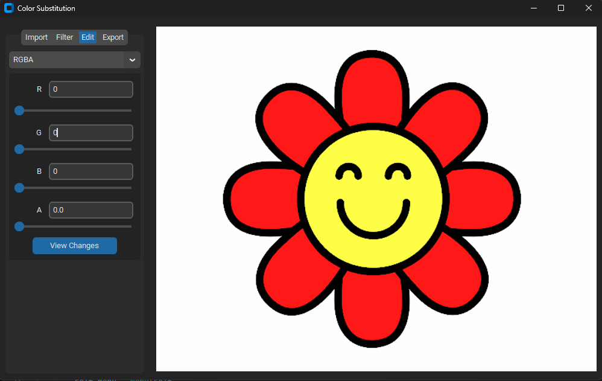
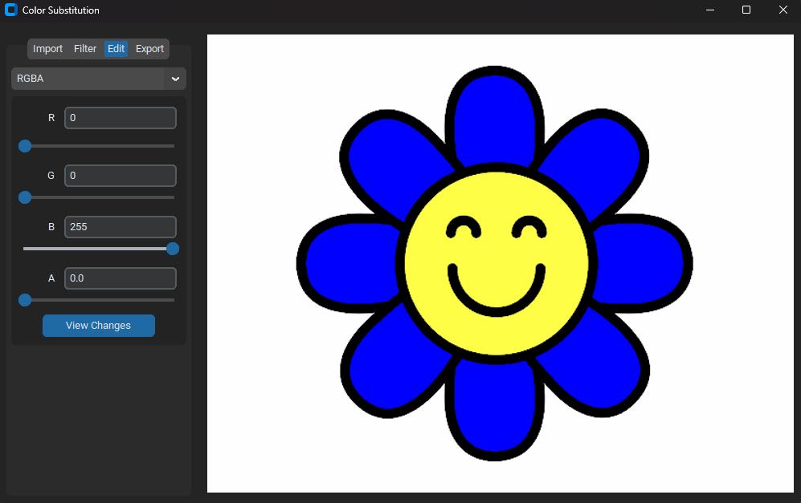

# Change_image_color

>Hello everyone, Change_image_color allows you to change pixels in an image. Adjust the filter, which is the range of values you want to be considered to be replaced, and then select the new color of the range with edit.
>
>Efficiency will depend on the values you use.
>
>

>

### Adjustments and improvements

The project is still in development, and the next updates will focus on the following tasks:

- [ ] Create an interactive online interface where you can visualize the image before and after
- [ ] Improve the interface for selecting pixels in the image
- [ ] Improve the interface for selecting the search area and the value range to be changed
- [ ] Fix saving as jpg
- [ ] Consolidate variables being passed to simplify functions
- [ ] Fix Channel switching dropdown.

## 💻 Prerequisites

Before you begin, make sure you have met the following requirements:

- Have Python installed on your system and the Pillow and CustomTkinter libraries installed.
- Operating system compatible with Python.
- Read the project usage guide.

## ☕ Using Change_image_color

To use Change_image_color, follow these steps:

1. Download the ZIP and extract.
2. Install the requirements.txt.
3. Execute `main.py`.
4. On the Import tab, use the "Open image" button to select the image you want to change.
5. On the Filter tab, select the range of values to be included in color substitution.
6. On the Edit tab, select the new value of the pixels that will be changed from filter tab.
7. On the Edit tab, apply alpha over the image with the A slider.
8. On the Edit tab, use the "View Changes" button to view the new image.
9. On the Export tab, name the file and choose extension.
10. On the Export tab, select save path.
11. On the Export tab, use the "Save" button to save the new image.

