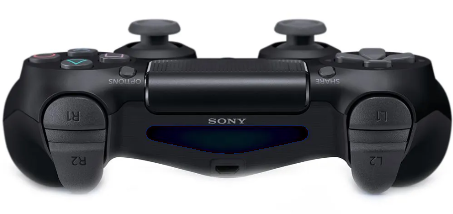

# Change_image_color

>Hello everyone, Change_image_color allows you to change pixels in an image. Adjust the filter, which is the range of values you want to be considered to be replaced, and then select the new color of the range with edit.
>
>Efficiency will depend on the values you use.
>
>

>

### Adjustments and improvements

The project is still in development, and the next updates will focus on the following tasks:

- [X] Improve the search for ranges and adjustment values
- [ ] Create an interactive online interface where you can visualize the image before and after
- [ ] Improve the interface for selecting pixels in the image
- [ ] Improve the interface for selecting the search area and the value range to be changed
- [ ] Add hex input to auto populate rgb edit values
- [ ] Fix saving as jpg
- [ ] Create default file name in export tab
- [ ] Validate entry boxes to ensure they are numbers
- [ ] Add help section
- [ ] Consolidate variables being passed to simplify functions

## 💻 Prerequisites

Before you begin, make sure you have met the following requirements:

- Have Python installed on your system and the Pillow and CustomTkinter libraries installed.
- Operating system compatible with Python.
- Read the project usage guide.

## ☕ Using Change_image_color

To use Change_image_color, follow these steps:

1. Download the code with the name `alterarcor.py`.
2. Install the required Python libraries used in the code (Pillow and Tkinter).
3. Execute the code; it will open a Tkinter window.
4. In this window, there are range values to search for pixels at the bottom using a slider.
5. Use the "Open file" button to select the image you want to change.
6. With the image open, apply the filters and change the color as desired.
7. Using the "Change" button, you can change the order of RGB, making the colors swap places or invert.
8. Using the "Add" button, you can add and subtract pixel values in the image, modifying its color.
9. After applying the filters, select the "Apply color" button to modify the image.
10. With the modified image, use "Save Image" to save the image.
11. In the case of RGBA, if you want to modify the alpha channel, "Add to channel A" serves this purpose.

